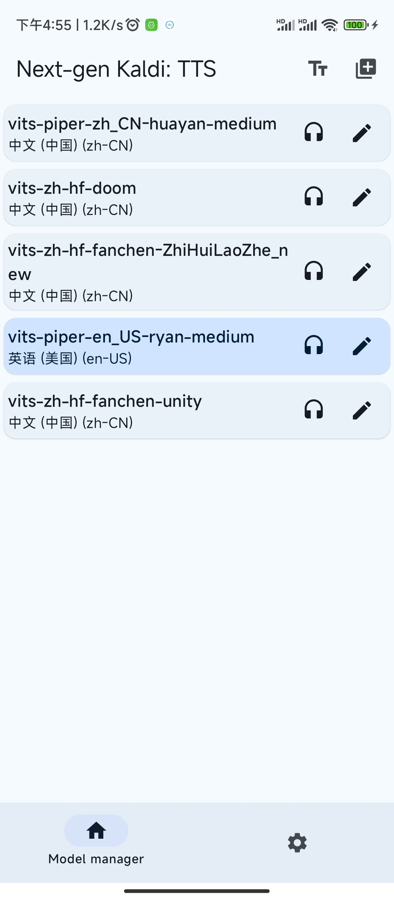

# SherpaOnnxTtsEngineAndroid

> [!NOTE]
> Automatic downloading and installation of models is now supported!

  
Original steps

Download Model:  https://github.com/k2-fsa/sherpa-onnx/releases/tts-models

then:

1. Open Application -> Import model package -> choose *.tar.bz2 model file -> Wait for the import to
   complete.

> or manual import:

1. Unzip to Android/data/com.k2fsa.sherpa.onnx.tts.engine/files/model
2. Open Application -> Add models

> On Android 13+ devices, use [MT Manager](https://mt2.cn/download/)
> or [Material Files](https://github.com/zhanghai/MaterialFiles)
> or [MiXplorer](https://xdaforums.com/t/app-2-2-mixplorer-v6-x-released-fully-featured-file-manager.1523691/)
> to access the Android/data path.

# Preview

