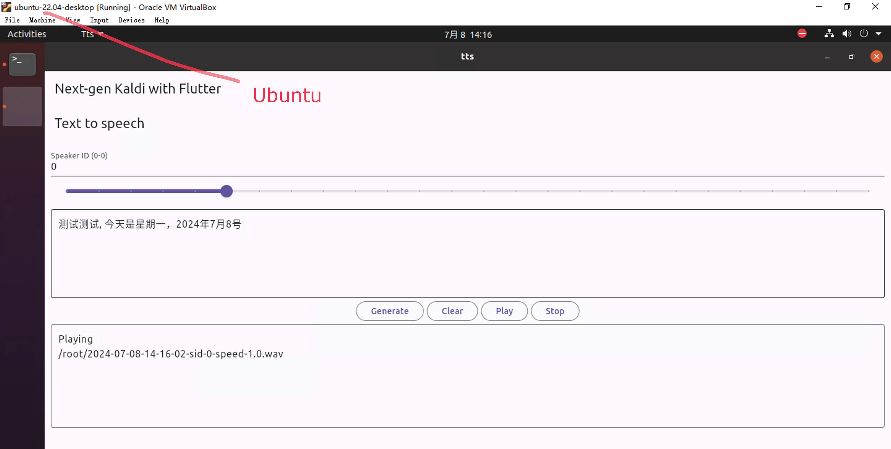

# tts

This example demonstrates how to use text to speech (TTS) in Flutter with sherpa-onnx.

It works on the following platforms:

  - Android
  - iOS
  - Linux
  - macOS (both arm64 and x86_64 are supported)
  - Windows

Screenshots are given below:

|Android|iOS|Linux|macOS|Windows|
|-------|---|-----|-----|-------|
||||||

## How to build

Before you run `flutter build`, you have to select a TTS model and change
the code to use your selected model.

### 1. Select a TTS model

We have a list of TTS models at

<https://github.com/k2-fsa/sherpa-onnx/releases/tag/tts-models>

You can select any of them. If you feel that there are so many that you don't know
which one is the best, please visit <http://huggingface.co/spaces/k2-fsa/text-to-speech>
and try each one by yourself and select the one you consider the best.

Suppose you select

  <https://github.com/k2-fsa/sherpa-onnx/releases/download/tts-models/vits-piper-en_US-libritts_r-medium.tar.bz2>

Then please do the following:

  - 1. Download and unzip the model

```bash
cd flutter-examples/tts/assets
wget https://github.com/k2-fsa/sherpa-onnx/releases/download/tts-models/vits-piper-en_US-libritts_r-medium.tar.bz2
tar xf vits-piper-en_US-libritts_r-medium.tar.bz2
rm vits-piper-en_US-libritts_r-medium.tar.bz2
cd ..

./generate-asset-list.py
```

  Note that you have to run [./generate-asset-list.py](./generate-asset-list.py) so that Flutter knows where
  to find the model.

  - 2. Change the code to use the downloaded model.

    We have given several examples for different models in [./lib/model.dart](./lib/model.dart).
    For our selected model, we need to change [./lib/model.dart](./lib/model.dart) so that it looks like below:

```
// Example 6
// https://github.com/k2-fsa/sherpa-onnx/releases/tag/tts-models
// https://github.com/k2-fsa/sherpa-onnx/releases/download/tts-models/vits-piper-en_US-libritts_r-medium.tar.bz2
modelDir = 'vits-piper-en_US-libritts_r-medium';
modelName = 'en_US-libritts_r-medium.onnx';
dataDir = 'vits-piper-en_US-libritts_r-medium/espeak-ng-data';
```

  - 3. That's it.

### Build the APP

  - 1. For Linux

```bash
flutter build linux

# See below if you get any errors
```

  - 2. For macOS

To build a universal2 APP, use

```bash
flutter build macos
```

To build for `x86_64`, use

```bash
export FLUTTER_XCODE_ARCHS=x86_64
flutter build macos
```

To build for `arm64`, use

```bash
export FLUTTER_XCODE_ARCHS=arm64
flutter build macos
```

  - 3. For Windows

```bash
flutter build windows
```

  - 4. For Android

```bash
flutter build apk --split-per-abi
```

  - 5. For iOS

First, connect your iPhone to your computer and use `flutter devices` to show
available devices. You will see something like below:

```
Found 3 connected devices:
  iPhone (mobile) • 00008030-001064212E85802E • ios            • iOS 16.3 20D47
  macOS (desktop) • macos                     • darwin-x64     • macOS 13.1 22C65 darwin-x64
  Chrome (web)    • chrome                    • web-javascript • Google Chrome 126.0.6478.127

No wireless devices were found.

Run "flutter emulators" to list and start any available device emulators.

If you expected another device to be detected, please run "flutter doctor" to diagnose potential issues. You may also try increasing the time to wait for connected devices with the "--device-timeout" flag. Visit https://flutter.dev/setup/ for troubleshooting tips.
```

Then you can use
```
flutter run -d 00008030-001064212E85802E --release
```

You would see something like below:
```
Launching lib/main.dart on iPhone in release mode...
Automatically signing iOS for device deployment using specified development team in Xcode project: N5ZH3Z63A6
Running pod install...                                           1,773ms
Running Xcode build...
Xcode build done.                                            7.9s
Failed to build iOS app
Could not build the precompiled application for the device.
Error (Xcode): No profiles for 'com.k2fsa.sherpa.onnx.tts' were found: Xcode couldn't find any iOS App Development provisioning profiles matching
'com.k2fsa.sherpa.onnx.tts'. Automatic signing is disabled and unable to generate a profile. To enable automatic signing, pass
-allowProvisioningUpdates to xcodebuild.
/Users/fangjun/open-source/sherpa-onnx/flutter-examples/tts/ios/Runner.xcodeproj


It appears that there was a problem signing your application prior to installation on the device.

Verify that the Bundle Identifier in your project is your signing id in Xcode
  open ios/Runner.xcworkspace

Also try selecting 'Product > Build' to fix the problem.

Error running application on iPhone.
```

After you have followed the instructions in the above log, run gain

> Note: I have run `open ios/Runner.xcworkspace` and click `Product -> Build`.

```
flutter run -d 00008030-001064212E85802E --release
```

Finally, it will show something like below:

```
Launching lib/main.dart on iPhone in release mode...
Automatically signing iOS for device deployment using specified development team in Xcode project: N5ZH3Z63A6
Running Xcode build...
 └─Compiling, linking and signing...                         6.5s
Xcode build done.                                           18.3s
Installing and launching...                                        22.9s

Flutter run key commands.
h List all available interactive commands.
c Clear the screen
q Quit (terminate the application on the device).
```

## Fix for Linux

If you get the following errors on Linux,

```
Building Linux application...
CMake Error at /usr/local/share/cmake-3.29/Modules/FindPkgConfig.cmake:634 (message):
  The following required packages were not found:

   - gstreamer-1.0

Call Stack (most recent call first):
  /usr/local/share/cmake-3.29/Modules/FindPkgConfig.cmake:862 (_pkg_check_modules_internal)
  flutter/ephemeral/.plugin_symlinks/audioplayers_linux/linux/CMakeLists.txt:24 (pkg_check_modules)
```

please run:

```bash
sudo apt-get install -y libgstreamer1.0-dev libgstreamer-plugins-base1.0-dev libunwind-dev
```

See also <https://github.com/bluefireteam/audioplayers/tree/main/packages/audioplayers_linux#setup-for-linux>
for the above error.
