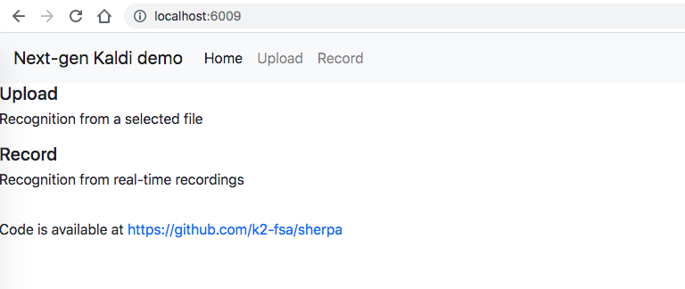

# How to use

```bash
git clone https://github.com/k2-fsa/sherpa

cd sherpa/sherpa/bin/web
python3 -m http.server 6009
```
and then go to <http://localhost:6009>

You will see a page like the following screenshot:



If your server is listening at the port *6006* with address **localhost**,
then you can either click **Upload**, **Streaming_Record** or **Offline_Record** to play with it.

## File descriptions

### ./css/bootstrap.min.css

It is downloaded from https://cdn.jsdelivr.net/npm/bootstrap@4.3.1/dist/css/bootstrap.min.css

### ./js/jquery-3.6.0.min.js

It is downloaded from https://code.jquery.com/jquery-3.6.0.min.js

### ./js/popper.min.js

It is downloaded from https://cdn.jsdelivr.net/npm/popper.js@1.14.7/dist/umd/popper.min.js

### ./js/bootstrap.min.js

It is download from https://cdn.jsdelivr.net/npm/bootstrap@4.3.1/dist/js/bootstrap.min.js
